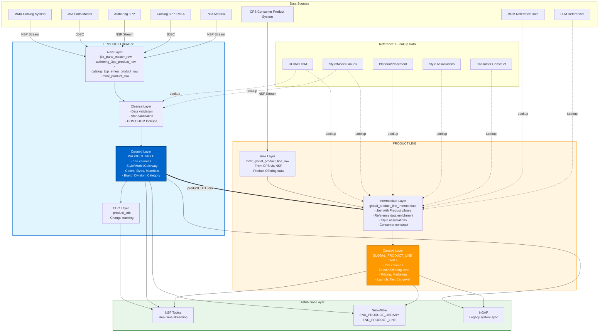

# Product Library and Product Line Analysis

## Executive Summary

This document provides a comprehensive analysis of the **Product Library** and **Product Line** data products within the Nike Product Dimensional Data (PDD) ecosystem. Both products are part of the Line Planning & Merchandising domain and serve distinct but interconnected purposes in managing product data throughout the product lifecycle.

---

## 1. Product Library Overview

### Purpose
Product Library is the **foundational product data repository** that stores comprehensive information about Nike products at the style, model, and colorway levels. It serves as the single source of truth for physical product attributes.

### Key Characteristics
- **Product Type**: Data Product
- **Team**: PDD-Line Planning & Merchandising
- **Organization**: DA (Data Analytics)
- **Tech Solution ID**: 3613062cf79eb1a4261f8bbf18d17b35e11dcf82
- **Documentation**: [Confluence Link](https://confluence.nike.com/display/EDAEDP/1.+Line+Plan)

### Primary Data Objects

#### 1.1 Product Table
The main table with **167 columns** containing:

**Core Identifiers:**
- `productUUID`, `productIdentifier`, `productCode`
- `styleNumber`, `styleName`, `modelIdentifier`, `modelName`
- `colorwayIdentifier`, `productColorwayCode`

**Product Attributes:**
- Division & Category information
- Gender, Age, Silhouette classifications
- Color specifications (primary, secondary, tertiary, quaternary, logo colors)
- Platform, Franchise, Fit preferences
- Material intent, Construction method
- Size grid and measurement specifications

**Business Attributes:**
- Status indicators (product, model, style status)
- Creation and modification metadata
- Company and licensing information
- Brand, segment, sub-brand classifications

**Structured Data:**
- `styleGroups` (ARRAY of STRUCT)
- `productPlanning` (STRUCT with hierarchy)
- `consumerConstruct` (STRUCT with global offense, dimension, sub-dimension)
- `technologies`, `features`, `complianceIntents` (ARRAY types)
- `productConfidentialityTo` (ARRAY for access control)

#### 1.2 Supporting Tables
- **product_authoring_data**: Subset for authoring workflows (48 columns)
- **product_mmx_data**: MMX-specific product data
- **product_emea_data**: EMEA region-specific product data
- **product_jba_nts_data**: JBA NTS system product data

### Data Sources & Integration Points

**Source Systems:**
1. **MMX (Main Catalog System)** - Primary product catalog
2. **JBA Parts Master** - JBA product data via PARTS_MASTER view
3. **Authoring 3PP** - Third-party product authoring system
4. **Catalog 3PP EMEA** - EMEA third-party catalog
5. **PCX Material Payload** - Material-related product data
6. **Global Product Line** (from CPS) - Product offering data

**Integration Mechanisms:**
- NSP (Nike Streaming Platform) topics for real-time ingestion
- NSP2 and NSP3 for different data streams
- Delta Lake tables for storage
- Databricks for processing

### Data Pipeline Architecture

```
Raw Layer (NSP Streams)
    ↓
Cleanse Layer (Validation, Standardization)
    ↓
Curated Layer (Business Logic, Enrichment)
    ↓
CDC Layer (Change Data Capture)
    ↓
Distribution (NSP Topics, Snowflake, NGAP)
```

**Processing Jobs:**
1. **Raw Ingestion**: Multiple source-specific apps
2. **Cleanse**: Data quality, standardization, lookup enrichment
3. **Curate**: 
   - MmxProductCurateIngestApp (primary)
   - AuthoringProductCurateIngestApp
   - EmeaProductCurateIngestApp
   - JbaNtsProductCurateIngestApp
4. **CDC**: ProductCdcIngestApp
5. **Distribution**: Snowflake, NSP, NGAP hydration

---

## 2. Product Line Overview

### Purpose
Product Line manages **merchandising and planning data** for products across seasons and markets. It extends Product Library data with offering-level information including pricing, marketing, seasonality, and go-to-market strategy.

### Key Characteristics
- **Product Type**: Data Product
- **Team**: PDD-Line Planning & Merchandising
- **Organization**: DA (Data Analytics)
- **Tech Solution ID**: 87e7c92a11630e85573860be32a6c09ad746f19a
- **Documentation**: [Confluence Link](https://confluence.nike.com/display/EDAEDP/1.+Line+Plan)

### Primary Data Objects

#### 2.1 Global Product Line Table
The main table with **222 columns** containing:

**Product Reference:**
- `globalProductLineUUID` (unique identifier)
- `product` (STRUCT with UUID reference to Product Library)
- All product identifiers from Product Library

**Offering-Level Attributes:**
- `productOfferingIdentifier`, `modelOfferingIdentifier`
- `seasonYearIdentifier`, `seasonYearDescription`, `seasonYearAbbreviation`
- `productOfferingStatusIndicator`, `modelOfferingStatusIndicator`

**Pricing & Financial:**
- `targetRetailPrice`, `targetWholesalePrice`
- `budgetFob`
- `currencyCode`, `currencyShortDescription`, `currencyLongDescription`

**Marketing & Launch:**
- `launchCode`, `launchDate`, `launchDescription`
- `marketingName`
- `primaryMarketingTypeIdentifier`, `primaryMarketingTypeDescription`
- `marketingInitiatives` (ARRAY)
- `specialOfferingTypes` (ARRAY)

**Merchandising & Planning:**
- `categoryInformationAnalystName`, `categoryProductLineManagerName`
- `initiatingProductLineManagerName`
- `developmentTeamIdentifier`, `developmentTeamName`
- `productCarryoverStatusIndicator`, `modelOfferingCarryoverStatusIndicator`
- `productTierCode`, `productTierDescription`

**Consumer Attributes:**
- `consumerPurposeIdentifier`, `consumerGroupIdentifier`
- `consumerUseIdentifier`, `consumerFocusIdentifier`
- `businessOrganizationCode`, `businessOrganizationDescription`

**Sales & Distribution:**
- `earliestAllowedOfferDate`
- `alwaysAvailableIndicator`
- `salesSampleIdentifier`, `salesSampleDescription`

**Structured Data:**
- `modelOfferingGroups`, `productOfferingGroups` (ARRAY)
- `alternateMarketingTypes` (ARRAY)
- `marketingTypeRestrictedAccount` (ARRAY)
- Inherits: `styleGroups`, `productGroups`, `features`, `technologies` from Product
- `modelOfferingConfidentialTo`, `productConfidentialTo` (ARRAY)

#### 2.2 Supporting Tables
- **global_product_line_intermediate**: Intermediate transformation layer
- **mmx_global_product_line_raw**: Raw data from CPS system
- **product_region_seasonal**: Regional seasonal planning data
- **product_merchandising_size**: Size-level merchandising data

### Data Sources & Integration Points

**Source Systems:**
1. **CPS (Consumer Product System)** - Product offering data from NSP topic
2. **Product Library** - Product master data (join dependency)
3. **LPM (Line Planning & Merchandising) References** - Reference data
4. **Style Associations** - Style-level hierarchies and attributes
5. **Consumer Construct** - Consumer segmentation data
6. **MDM (Master Data Management)** - UOM, DUOM, Product Company lookups

**Lookup Dependencies:**
- `mdm_iso_measurement_uom_raw` - Unit of measure
- `mdm_iso_measurement_duom_raw` - Delivery unit of measure
- `model_offering_group`, `model_offering_group_type`
- `style_group`, `style_group_type`
- `placement`, `platform`, `platform_group`
- `lpm_style_associations_cleanse`
- `product` (from Product Library)
- `style` curated data

### Data Pipeline Architecture

```
Global Product Line Raw (NSP Stream from CPS)
    ↓
Global Product Line Intermediate (Enrichment with Lookups)
    ↓
Global Product Line Curated (Final Business Logic)
    ↓
Distribution (NSP Topics, Snowflake, NGAP)
```

**Processing Jobs:**
1. **Raw Ingestion**: 
   - GlobalProductLineConfidentialityRawIngestApp
   - Reads from CPS producer topic
2. **Intermediate Curation**:
   - gplCurateIngestApp
   - Joins with Product Library
   - Applies reference lookups
   - Enriches with style associations and consumer construct
3. **Final Curation**:
   - GlobalProductLineCurateIngestApp
   - Adds confidentiality attributes
4. **Distribution**: Snowflake, NSP, NGAP hydration

---

## 3. Relationship Between Product Library and Product Line

### Key Differences

| Aspect | Product Library | Product Line |
|--------|----------------|--------------|
| **Focus** | Physical product attributes | Merchandising & offering attributes |
| **Level** | Style, Model, Colorway, Product | Product Offering, Model Offering, Season |
| **Lifecycle** | Product creation through discontinuation | Line planning through market launch |
| **Seasonality** | Seasonless (physical attributes) | Season-specific (offerings) |
| **Primary Users** | Product developers, designers, catalog teams | Merchandisers, planners, buyers |
| **Cardinality** | 1 Product = 1 Record | 1 Product = N Records (per season/market) |
| **Price Data** | No pricing | Target retail/wholesale prices |
| **Marketing** | No marketing data | Marketing campaigns, launch dates |

### Data Flow Relationship

```
Product Library (Source of Truth for Products)
    ↓ (Reference via productUUID)
Product Line (Extends with Offering Data)
```

**Join Relationship:**
```sql
global_product_line.product.uuid = product.productUUID
```

### Integration Pattern

1. **Product Creation** → Product Library creates master product record
2. **Product Offering Planning** → Product Line creates seasonal offering record
3. **Reference Linking** → Product Line stores product STRUCT with UUID reference
4. **Attribute Inheritance** → Product Line includes key product attributes for denormalization
5. **Independent Updates** → Product attributes update in Product Library; offerings update in Product Line

---

## 4. Data Flow Diagram



---

## 5. Processing Schedules

### Product Library
- **Schedule**: Every 4 hours (`0 */4 * * *`)
- **Pipeline Sequence**:
  1. Raw ingestion (parallel for all sources)
  2. Cleanse layer processing
  3. Style Associations dependency check
  4. MMX Curate (main)
  5. 3PP Curates (Authoring, EMEA, JBA)
  6. CDC generation
  7. Distribution to downstream systems

### Product Line
- **Schedule**: Every 30 minutes (`*/30 * * * *`)
- **Pipeline Sequence**:
  1. Raw ingestion (Global Product Line Confidentiality)
  2. Intermediate layer curation (joins Product Library)
  3. Final curation
  4. Distribution to downstream systems

**Note**: Product Line runs more frequently (30 min vs 4 hours) to capture rapid changes in offerings and merchandising plans.

---

## 6. Key Design Patterns

### 6.1 Product Library Patterns

**Multi-Source Integration:**
- Separate raw ingestion jobs per source system
- Source-specific cleanse logic
- Consolidated curated product table

**Incremental Processing:**
- CDC (Change Data Capture) for delta tracking
- Merge operations based on productUUID
- Timestamp-based change tracking

**Nested Data Structures:**
- STRUCT for grouped attributes (productPlanning, consumerConstruct)
- ARRAY for multi-valued attributes (styleGroups, technologies, features)
- Enables atomic updates and schema evolution

### 6.2 Product Line Patterns

**Reference Architecture:**
- Explicit STRUCT reference to Product Library: `product STRUCT<uuid: STRING, type: STRING>`
- Denormalized key attributes for query performance
- Maintains referential integrity via UUID

**Intermediate Layer:**
- Dedicated intermediate table for complex transformations
- Separates raw ingestion from business logic
- Enables reprocessing and validation

**Confidentiality Management:**
- Separate confidentiality raw stream
- `productConfidentialTo` and `modelOfferingConfidentialTo` arrays
- Row-level access control via Active Directory groups

**Seasonal Cardinality:**
- One product → Many product offerings (per season)
- Natural key: `productIdentifier + seasonYearDescription`
- Carryover status indicators for planning

---

## 7. Critical Dependencies

### Product Library Dependencies
1. **Style Associations** - Must complete before MMX curate
2. **MDM Reference Data** - UOM, DUOM lookups
3. **Style/Model Groups** - Classification hierarchies

### Product Line Dependencies
1. **Product Library** - Primary join dependency
2. **Style Associations** - Hierarchy and L5/L6 attributes
3. **Consumer Construct** - Consumer segmentation
4. **LPM References** - Line Evolution, Season dates
5. **MDM Lookups** - Product Company, UOM, DUOM
6. **Model Offering Groups** - Offering classifications
7. **Platform/Placement** - Additional platform attributes

---

## 8. Data Governance

### Ownership
- **Product Owners**: Jega.Thangavel@nike.com, Monarch.Himanshu@nike.com
- **Data Owners**: Ramanaresh.Challa@nike.com, Bharath.Hegde@nike.com

### Data Confidentiality
Both products implement confidentiality controls:
- `productConfidentialityTo` (Product Library)
- `productConfidentialTo` + `modelOfferingConfidentialTo` (Product Line)
- Active Directory group-based access

### Data Quality
- Natural key constraints in raw layers
- NOT NULL filters on critical identifiers
- Duplicate handling via timestamp-based deduplication
- Error logging tables for tracking failures

---

## 9. Technology Stack

### Storage
- **Delta Lake** for all layers (Raw, Cleanse, Curated)
- **Hive Metastore** for catalog management
- **Databricks Unity Catalog** for governance

### Processing
- **Apache Spark** (Scala) for ETL transformations
- **Databricks** cluster compute
- **Airflow** for orchestration

### Streaming
- **NSP (Nike Streaming Platform)** for event streaming
- **NSP3** for next-generation streaming
- **Kafka** under the hood

### Distribution
- **Snowflake** for analytics consumption
- **NSP Topics** for downstream applications
- **NGAP** for legacy system integration

### Programming
- **Scala** (primary ETL language)
- **Python** (Airflow DAGs, utilities)

---

## 10. Use Cases

### Product Library Use Cases
1. **Product Catalog Management** - Maintain master product records
2. **Product Search & Discovery** - Enable product finding by attributes
3. **Style/Color Reporting** - Analyze product portfolio by style, color, silhouette
4. **Compliance Tracking** - Track compliance intents and features
5. **Brand Portfolio Analysis** - Analyze products by brand, division, category
6. **Material Intent Tracking** - Track sustainable and material specifications

### Product Line Use Cases
1. **Seasonal Line Planning** - Plan product offerings by season
2. **Price Management** - Set and track target retail/wholesale prices
3. **Launch Planning** - Plan product launches and go-to-market
4. **Carryover Analysis** - Identify carryover vs. new products
5. **Tier Planning** - Manage product tier strategies (good/better/best)
6. **Marketing Campaign Planning** - Associate products with marketing initiatives
7. **Budget vs. Actual** - Track budget FOB vs. actual costs
8. **Sales Sample Management** - Manage sales sample inventory

---

## 11. Key Metrics & Attributes

### Product Library Key Metrics
- Number of unique products (by productUUID)
- Number of styles (by styleNumber)
- Number of models (by modelIdentifier)
- Products by status (Active/Inactive/Pending)
- Products by division, category, gender, age
- New products created per period

### Product Line Key Metrics
- Number of product offerings (by globalProductLineUUID)
- Offerings by season year
- Offerings by status (Active/Planned/Discontinued)
- Average target retail price by category
- Number of new vs. carryover products
- Offerings by product tier
- Offerings by marketing type
- Launch count by launch date

---

## 12. Summary

### Product Library
- **What**: Master product catalog with physical attributes
- **When**: Created during product development
- **Who**: Product creators, designers, catalog teams
- **Why**: Single source of truth for product data
- **How**: Integrated from multiple authoring systems (MMX, JBA, 3PP)

### Product Line
- **What**: Merchandising and seasonal planning data
- **When**: Created during line planning cycles
- **Who**: Merchandisers, planners, buyers, analysts
- **Why**: Enable seasonal planning, pricing, and go-to-market decisions
- **How**: Extends Product Library with offering-level attributes via CPS system

### Integration
Product Line **extends** Product Library by adding temporal, financial, and merchandising dimensions to products, enabling comprehensive product lifecycle management from creation through market launch and sales.

---

## 13. Recommendations

### For Data Consumers
1. **Join on UUID**: Use `product.uuid` for joins between Product Line and Product Library
2. **Check Status**: Always filter by status indicators (product, offering, model)
3. **Handle Seasonality**: Be aware that Product Line has multiple records per product (per season)
4. **Use Denormalized Attributes**: Product Line includes key product attributes for performance
5. **Respect Confidentiality**: Check confidentiality arrays before exposing data

### For Data Producers
1. **Maintain UUID Integrity**: Ensure productUUID consistency across systems
2. **Update Frequency**: Product Library changes less frequently than Product Line
3. **Reference Data**: Keep lookups (UOM, groups, platforms) synchronized
4. **Change Tracking**: Use CDC for incremental updates
5. **Data Quality**: Validate natural keys and critical identifiers

---

**Document Version**: 1.0  
**Last Updated**: November 24, 2025  
**Prepared By**: AI Analysis System  

