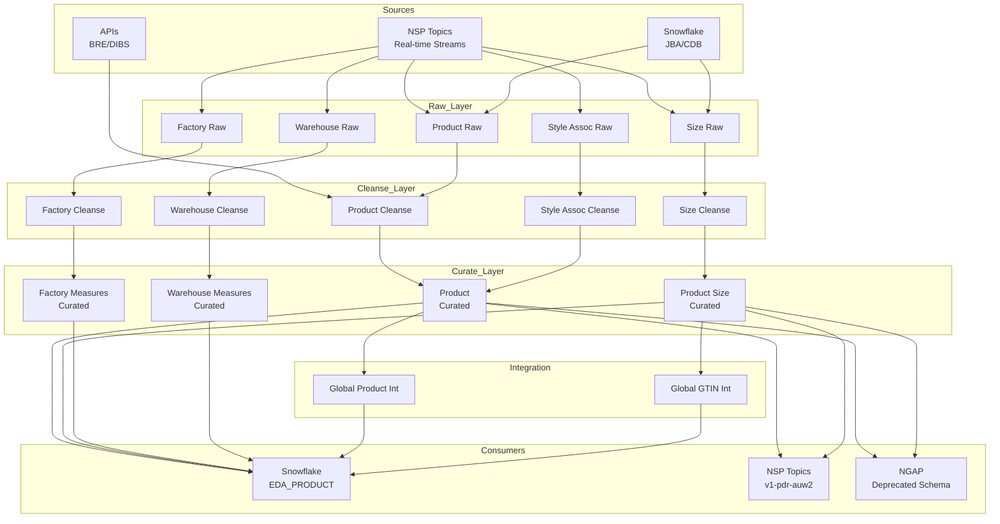
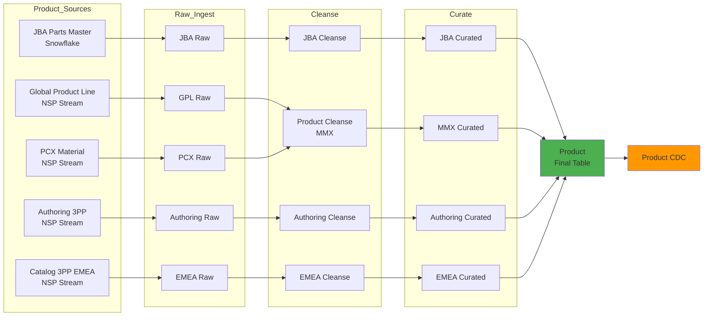
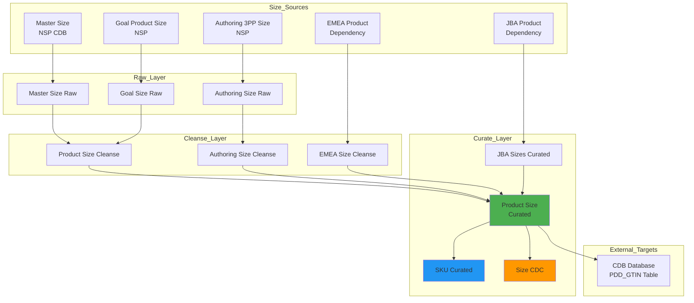
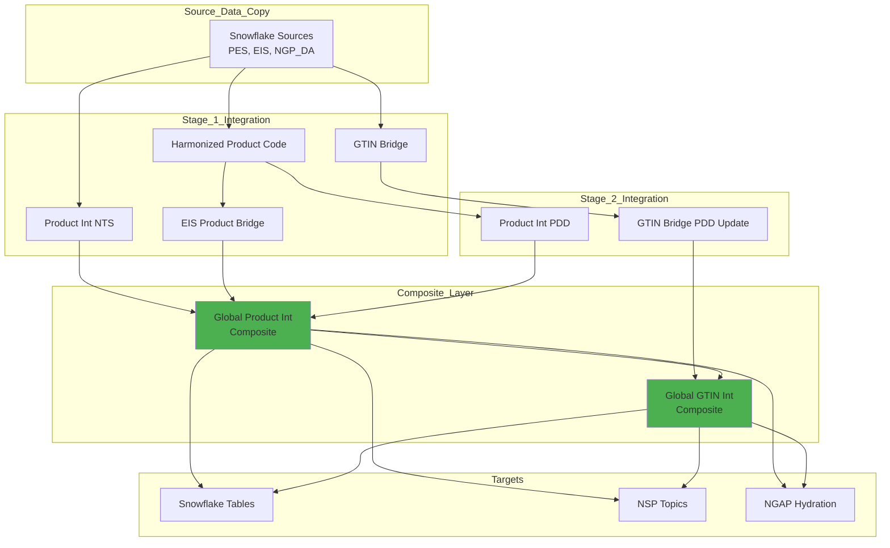
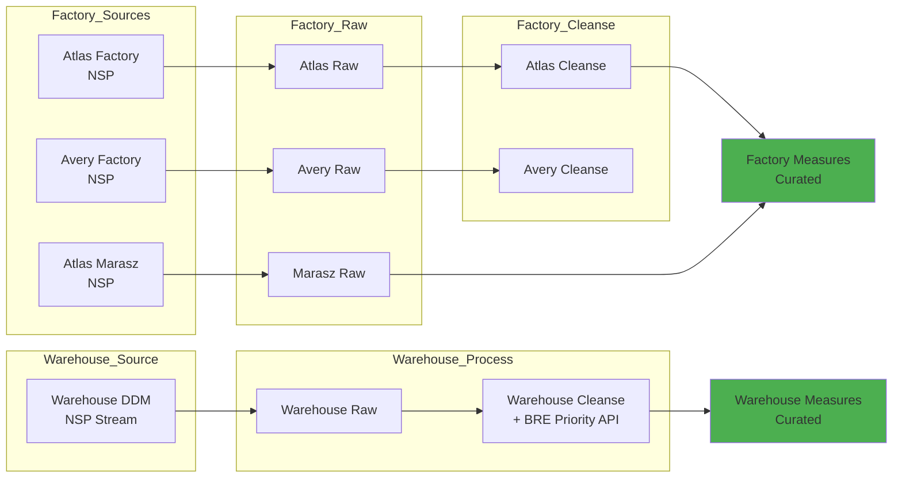
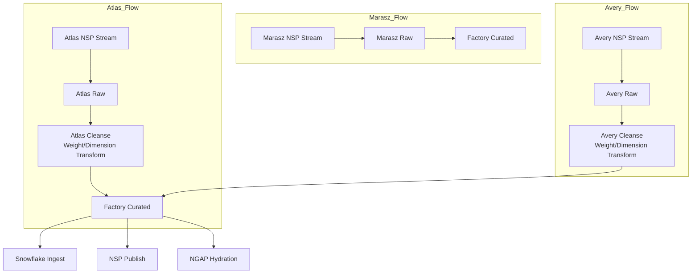
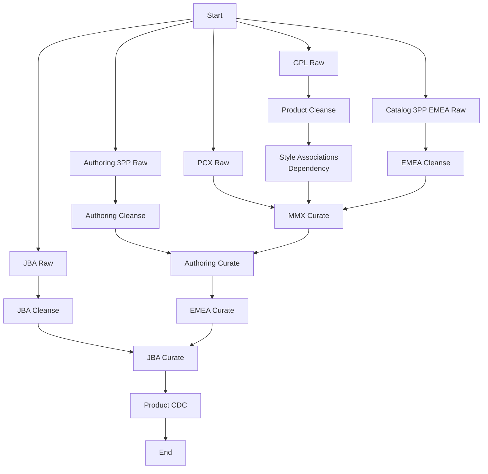
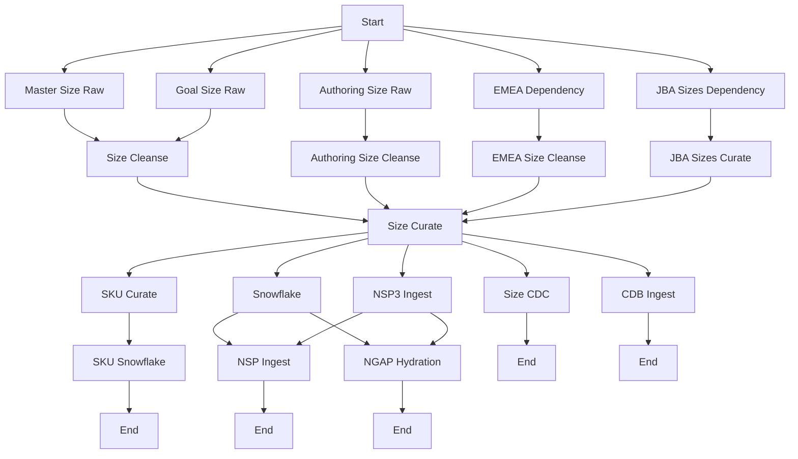
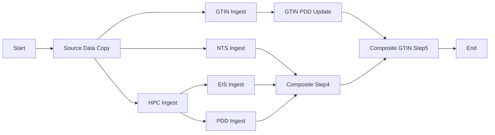

# Product Library - Understanding Document

## Table of Contents
1. [Executive Summary](#executive-summary)
2. [Product Overview](#product-overview)
3. [Architecture Overview](#architecture-overview)
4. [Data Components](#data-components)
5. [Data Flow Diagrams](#data-flow-diagrams)
6. [Sub-Components Deep Dive](#sub-components-deep-dive)
7. [Technologies & Infrastructure](#technologies--infrastructure)
8. [Data Sources & Sinks](#data-sources--sinks)
9. [Orchestration & Scheduling](#orchestration--scheduling)
10. [Data Quality & Error Handling](#data-quality--error-handling)

---

## Executive Summary

**Product Library** is a comprehensive data product within Nike's Product Dimensional Data (PDD) ecosystem that manages product master data across multiple sources including:
- Nike's internal product systems (MMX, JBA, Goal)
- Third-party partner products (3PP)
- Factory and warehouse measurements
- Global product line planning data

The product library serves as a centralized repository for product information, sizes, GTINs (Global Trade Item Numbers), and associated metadata, supporting both Nike-owned and partner products across multiple geographies.

### Key Metrics
- **Product Type**: Data Product
- **Team**: PDD - Line Planning & Merchandising
- **Programming Languages**: Scala, Python
- **Schedule**: Every 4 hours (0 */4 * * *)
- **Organization**: DA (Data Analytics)

---

## Product Overview

### Purpose
Product Library provides:
1. **Unified Product Master Data** - Single source of truth for product information
2. **Size & GTIN Management** - Comprehensive SKU-level data with global identifiers
3. **Multi-Source Integration** - Harmonizes data from 10+ source systems
4. **Global Product Visibility** - Supports seasonless integrated product views
5. **Compliance & Quality** - Tracks product weights, measures, and quality attributes

### Data Owners
- **Product Owners**: Jega Thangavel, Monarch Himanshu
- **Data Owners**: Ramanaresh Challa, Bharath Hegde

---

## Architecture Overview

```
┌─────────────────────────────────────────────────────────────────────────┐
│                        PRODUCT LIBRARY ECOSYSTEM                         │
└─────────────────────────────────────────────────────────────────────────┘

┌──────────────────┐        ┌──────────────────┐        ┌──────────────────┐
│   Data Sources   │        │   Processing     │        │  Data Consumers  │
│                  │        │   Layers         │        │                  │
│ • NSP Streams    │───────▶│ • Raw            │───────▶│ • Snowflake      │
│ • Snowflake DBs  │        │ • Cleanse        │        │ • NSP Topics     │
│ • APIs (BRE)     │        │ • Curate         │        │ • NGAP           │
│ • File Systems   │        │                  │        │ • Databricks     │
└──────────────────┘        └──────────────────┘        └──────────────────┘
         │                           │                           │
         └───────────────────────────┴───────────────────────────┘
                     Orchestrated by Apache Airflow
```

### Layer Architecture

The product library follows a **Medallion Architecture** pattern:

1. **Raw Layer** (Bronze): Ingests data from source systems as-is
2. **Cleanse Layer** (Silver): Data quality, standardization, validation
3. **Curate Layer** (Gold): Business logic, enrichment, integration

---

## Data Components

Product Library consists of **7 major data components**:

### 1. Product (Core)
The primary product entity containing style, model, and colorway information.

**Key Sub-types:**
- **MMX Product**: Nike-owned products from merchandising systems
- **JBA Product**: NTS (Nike Team Sports) products from JBA Parts Master
- **Authoring 3PP**: Third-party partner products (non-Nike)
- **Catalog 3PP EMEA**: EMEA region third-party products
- **GPL (Global Product Line)**: Product line planning data from PES/CPS

### 2. Product Size
Size-level product information including GTINs and SKUs.

**Components:**
- Master Size (CDB)
- Product Size Goal
- Authoring 3PP Sizes
- JBA Sizes
- SKU (Stock Keeping Unit)

### 3. Factory Product Weight & Measures
Physical measurements from factory sources.

**Sources:**
- **Atlas**: Factory weight measurements
- **Atlas Marasz**: Factory measurements (alternate source)
- **Avery**: Factory weight and dimension data

### 4. Warehouse Product Weights & Measures
Measured product dimensions from warehouse nodes.

**Source**: Global Weights and Measures DDM (NSP Stream)

### 5. Style Associations
Product hierarchy, consumer construct, and planning attributes.

**Components:**
- Consumer Construct
- Dimension & Sub-Dimension
- Product Hierarchy
- Planning Program
- Planning Performance Activity

### 6. Global Seasonless Integrated
Commercial analytics integration layer.

**Components:**
- Harmonized Product Code (HPC)
- Product Integrated (PDD & NTS views)
- EIS Product Identifier Bridge
- GTIN Bridge
- Composite Product View
- Composite GTIN View

### 7. SAPR Connect
SAP R/3 connectivity data for third-party products.

---

## Data Flow Diagrams

### 1. High-Level Product Library Data Flow



### 2. Product Component Data Flow



### 3. Product Size Data Flow



### 4. Global Seasonless Integrated Flow



### 5. Factory & Warehouse Weights Flow



---

## Sub-Components Deep Dive

### 1. Product Component

#### 1.1 JBA Product Flow
**Source**: Snowflake (`NAA_DA_PROD.NA_MPA.PARTS_MASTER`)

```
Snowflake PARTS_MASTER
         ↓
    JBA Raw Ingest
    (JbaPartsMasterRawIngestApp)
         ↓
    JBA Cleanse
    - Lookup: Silhouette, Gender/Age, League, Team
    - Transform: NTS specific attributes
    (JbaNtsProductCleanseIngestApp)
         ↓
    JBA Curate
    - Business logic
    - Integration with other product sources
    (JbaNtsProductCurateIngestApp)
         ↓
    Product (Final Table)
```

**Key Attributes**:
- Part Code (Natural Key)
- Team Sports specific data
- League/Team associations
- Customization attributes

#### 1.2 MMX Product Flow
**Source**: NSP Topic (`v1-pdr-auw2-ems-*`)

```
NSP MMX Product Stream
         ↓
    Product Cleanse
    - Model Group/Type enrichment
    - UOM standardization
    - Style Group associations
    (ProductCleanseIngestApp)
         ↓
    MMX Product Curate
    - Consumer Construct join
    - Style Associations integration
    - Product Hierarchy
    - Supporting Attributes
    - L5/L6 Attributes
    - Platform/Placement enrichment
    - BOM integration
    (MmxProductCurateIngestApp)
         ↓
    Product (Final Table)
```

**Key Attributes**:
- Product Code (Natural Key)
- Style Number
- Model Information
- Color attributes (Primary through Logo Accent)
- Planning dimensions
- Technology & Features

#### 1.3 Authoring 3PP Product Flow
**Source**: NSP 3 Topic (Partner Products)

```
NSP Authoring 3PP Stream
         ↓
    Authoring 3PP Raw
    (Authoring3ppProductRawIngestApp)
         ↓
    Authoring 3PP Cleanse
    (Authoring3ppProductCleanseIngestApp)
         ↓
    Authoring 3PP Curate
    - Partner product enrichment
    - Size integration
    (AuthoringProductCurateIngestApp)
         ↓
    Product (Final Table)
```

**Key Attributes**:
- Partner Product Code
- Product Company Code (Natural Keys)
- Third-party indicator flags
- Partner-specific attributes

#### 1.4 Catalog 3PP EMEA Product Flow
**Source**: NSP Topic (EMEA Partner Products)

```
NSP Catalog 3PP EMEA Stream
         ↓
    Catalog 3PP EMEA Raw
    (Catalog3ppEmeaProductRawIngestApp)
         ↓
    Catalog 3PP EMEA Cleanse
    - Product Company lookup
    - Cleanse reference data
    - UOM standardization
    (Catalog3ppEmeaProductCleanseIngestApp)
         ↓
    EMEA Product Curate
    - EMEA-specific enrichment
    (EmeaProductCurateIngestApp)
         ↓
    Product (Final Table)
```

**Transformation Logic**:
```scala
Product Sources → Parallel Cleansing → Sequential Curation
   MMX ──┐
   JBA ──┤
  3PP A ─┼──→ [Cleanse Layer] ──→ [Curate Layer] ──→ [Product Table]
  3PP E ─┘                           ↑
                                     │
                            Style Associations
                            Consumer Construct
                            Product Hierarchies
```

### 2. Product Size Component

#### Size Processing Flow

```
┌─────────────────────────────────────────────────────────────┐
│                   Product Size Inputs                        │
├────────────┬───────────────┬───────────────┬────────────────┤
│ Master     │ Goal Product  │ Authoring 3PP │ JBA Sizes      │
│ Size (CDB) │ Size          │ Sizes         │ (Dependency)   │
└────────────┴───────────────┴───────────────┴────────────────┘
         │            │               │                │
         └────────────┴───────────────┴────────────────┘
                           ↓
                  Product Size Cleanse
                  - Merge all size sources
                  - Size translation
                  - Master size grid mapping
                           ↓
                  Product Size Curate
                  - Product join (enrichment)
                  - GTIN assignment
                  - Weight enrichment (Esquel)
                  - Alternate size calculations
                           ↓
              ┌───────────┴───────────┬───────────┐
              ↓                       ↓           ↓
         Product Size              SKU         Size CDC
        (Final Table)            (Table)       (Table)
```

**Size Curation Logic**:
1. **Slicing Strategy**: Processes data in batches (slicingCount=50, repartitionCount=8)
2. **Delta Processing**: Maintains delta dataframes for incremental updates
3. **Weight Enrichment**: Joins with Esquel size weights for physical measurements
4. **GTIN Generation**: Creates first/second quality GTINs and alternate GTINs
5. **Alternate Sizes**: Calculates size type mappings (chest, waist, age, top, bottom)

**Outputs**:
- **Product Size**: Primary size table with GTINs
- **SKU**: Detailed SKU-level information
- **Product Size CDC**: Change data capture for downstream systems
- **CDB GTIN**: Writes to external CDB Oracle database (`NSC_DATAGATE.PDD_GTIN`)

### 3. Factory Product Weight & Measures

#### Multi-Source Factory Flow



**Cleansing Logic**:
- Standardizes weight units to KG
- Converts dimension units (CM, MM, IN)
- Validates measurement ranges
- Deduplicates across sources

### 4. Warehouse Product Weights & Measures

#### Warehouse Measurement Flow

```
Global Weights & Measures NSP Stream
    (productCode, sizeCode, nodeCode)
              ↓
    Warehouse Measures Raw
              ↓
    Warehouse Measures Cleanse
    ┌─────────┴─────────┐
    │                   │
    ↓                   ↓
BRE Priority API    Validation
(Node Priority)     (Product/Size exists)
    │                   │
    └─────────┬─────────┘
              ↓
    Warehouse Measures Curated
    - Join with Product
    - Join with Product Size
    - Priority-based selection
```

**Business Rules Engine (BRE) Integration**:
- **API**: `https://api.preprod.bre.nike.com/v2/evaluate`
- **Workspace**: Nike/SECLogisticsDev
- **Project**: NodemgmtWeightsAndMeasuresPriorityRules
- **Decision**: PlantPriority

### 5. Style Associations

#### Style Association Components

```
┌──────────────────────────────────────────────────────────┐
│              Style Association Inputs                     │
├────────────┬─────────────┬──────────────┬────────────────┤
│ Consumer   │ Dimension & │ Product      │ Planning       │
│ Construct  │ Sub-Dim     │ Hierarchy    │ Program        │
├────────────┼─────────────┼──────────────┼────────────────┤
│ Planning   │ Planning    │ Product      │ Product        │
│ Perf Act   │ Perf Act Grp│ Dimension    │ Consumer       │
│            │             │ Reference    │ Reference      │
└────────────┴─────────────┴──────────────┴────────────────┘
                         ↓
              Style Associations Cleanse
              - LPM Reference Mapping
              - Natural key validation (styleNumber)
              - Cross-reference resolution
                         ↓
              Enriches Product Curated Layer
              - Product Hierarchy structure
              - Consumer Construct attributes
              - Planning dimensions
              - Performance activities
```

**Inputs** (All NSP Streams):
1. `lpm_consumer_construct_raw`
2. `sub_dimension_raw`
3. `lpm_dimension_raw`
4. `lpm_product_hierarchy_branch_raw`
5. `lpm_product_hierarchy_level_raw`
6. `lpm_product_hierarchy_raw`
7. `lpm_planning_program_raw`
8. `lpm_product_dimension_reference_raw`
9. `lpm_planning_performance_activity_raw`
10. `lpm_planning_performance_activity_group_raw`
11. `lpm_consumer_raw`
12. `lpm_product_consumer_reference_raw`
13. `lpm_product_values_reference_raw`

**Output**: `lpm_style_associations_cleanse`

### 6. Global Seasonless Integrated

#### Commercial Analytics Integration

The Global Seasonless Integrated component creates unified product views for commercial analytics by integrating:
- PDD Product data
- NTS (Nike Team Sports) data
- EIS (Enterprise Information Systems) data
- GTIN mappings
- Product line data

**Processing Steps**:

```
Step 1: Source Data Copy
   Snowflake → Databricks
   - PES ARIA Product
   - EIS Product
   - Global Category/Division
   - Trade Item History
   - DTC Product Master
         ↓
Step 2: Harmonized Product Code
   Product Table → HPC
   - Creates product code harmonization
         ↓
Step 3: NTS Integration
   EIS + Product Line → Product Int NTS
   - Division, Gender/Age, Silhouette
   - Category, Sport Activity
         ↓
Step 4: EIS Bridge
   EIS + HPC + Product Line → EIS Bridge
   - Product identifier mappings
         ↓
Step 5: GTIN Bridge
   Product + Product Size + EIS → GTIN Bridge
   - GTIN to product mappings
         ↓
Step 6: PDD Integration
   Product Line + Product + Planning → Product Int PDD
   - PDD-specific attributes
   - Planning dimensions
   - Franchise information
         ↓
Step 7: GTIN PDD Update
   GTIN Bridge + Product Size → Updated GTIN Bridge
   - Enriches GTIN with PDD attributes
         ↓
Step 8: Composite Product
   NTS + EIS + PDD → Global Product Int
   - Unified product view
         ↓
Step 9: Composite GTIN
   Product Int + GTIN Bridge → Global GTIN Int
   - Unified GTIN view with all attributes
```

**Output Tables**:
- `commercial_analytics_harmonized_product_code`
- `commercial_analytics_product_int_nts`
- `commercial_analytics_product_int_pdd`
- `commercial_analytics_eis_product_identifier_bridge`
- `commercial_analytics_gtin_bridge`
- `commercial_analytics_global_product_int`
- `commercial_analytics_global_gtin_int`

### 7. SAPR Connect

#### SAP R/3 Integration

```
Catalog 3PP NA Product (Raw)
    (sapMaterialNumber, productCode, vendorName)
              ↓
    SAPR Connect Curate
    - SAP material mapping
    - Vendor relationships
              ↓
    ┌─────────┴─────────┐
    ↓                   ↓
Snowflake           NGAP
SAPR_CONNECT_T1    sapr_connect_d
```

**Purpose**: Provides connectivity information for third-party products in SAP R/3 systems.

---

## Technologies & Infrastructure

### Data Processing Technologies

| Technology | Purpose | Usage |
|------------|---------|-------|
| **Apache Spark (Scala)** | Distributed data processing | Primary ETL engine for all transformations |
| **Databricks** | Cloud data platform | Execution environment for Spark jobs |
| **Delta Lake** | Table format | All tables use Delta format for ACID transactions |
| **Apache Airflow** | Workflow orchestration | Schedules and manages DAG executions |
| **NSP (Nike Streaming Platform)** | Event streaming | Primary data ingestion mechanism |
| **Snowflake** | Cloud data warehouse | Source and target system |
| **Oracle CDB** | Legacy database | Target for product size GTIN data |

### Infrastructure Components

```
┌─────────────────────────────────────────────────────────────┐
│                     Compute Resources                        │
├──────────────┬──────────────────┬──────────────────────────┤
│ Small Cluster│ Medium Cluster   │ Large Cluster            │
│ - Raw ingest │ - NSP multi-ingest│ - Product cleanse       │
│ - Most tasks │                  │ - Size curate (8 workers)│
├──────────────┴──────────────────┴──────────────────────────┤
│            Memory-Optimized Clusters                        │
│ - MMX Product Curate                                        │
│ - Authoring Product Curate                                  │
└─────────────────────────────────────────────────────────────┘

┌─────────────────────────────────────────────────────────────┐
│                    Storage Locations                         │
├─────────────────────────────────────────────────────────────┤
│ Databricks Volumes (Unity Catalog)                          │
│ - /Volumes/{catalog}/{schema}/{table}                       │
│ - Checkpoint locations for streaming                        │
│   /Volumes/.../nsp_checkpoint/{component}/{table}/{app}     │
│ - Delta dataframe staging                                   │
│   /Volumes/.../product_size_cur_ing_dataframes/             │
└─────────────────────────────────────────────────────────────┘
```

### Environment Configuration

The product library supports **3 environments**:

| Environment | Database | Warehouse | NSP Environment |
|-------------|----------|-----------|-----------------|
| **Dev** | `EDA_PRODUCT_DEV` | `EDA_PRODUCT_PREPROD` | QA/Staging |
| **QA** | `EDA_PRODUCT_DEV` | `EDA_PRODUCT_PREPROD` | PreProd |
| **Prod** | `EDA_PRODUCT_PROD` | `EDA_PRODUCT_PROD` | Production |

Configuration files:
- `application-dev.conf`
- `application-qa.conf`
- `application-prod.conf`

### Auto-scaling Configuration

```scala
// Example from Product Size Curate
autoscale = {
  "min_workers": 8,
  "max_workers": 8
}

// Example from Product Size Cleanse
autoscale = {
  "min_workers": 1,
  "max_workers": 8
}
```

---

## Data Sources & Sinks

### Input Sources

#### NSP Topics (Streaming Sources)

| Component | NSP Topic | Bootstrap Server | Group ID |
|-----------|-----------|------------------|----------|
| **Master Size** | `v1-htp-auw2-ems-6c536528-077e-47d0-abc1-cbe2f44cc1a4-main` | Production | nike.data360.product360 |
| **Goal Product Size** | `v1-pdr-auw2-ems-1472b819-c9e8-4824-b8b0-fd9a2fb4c40e-main` | Production | nike.data360.product360 |
| **Authoring 3PP Product** | `test-us-west-2-general-v2-55d93880-...` | NSP3 Staging | sole-dev-product-pdddirect |
| **Authoring 3PP Size** | `test-us-west-2-general-v2-143db5b2-...` | NSP3 Staging | sole-dev-product-size-pdddirect |
| **Atlas Factory** | `v1-htp-auw2-ems-b5c828c4-ba4f-4b74-b044-8170b96fde10-main` | Production | nike.data360.product360 |
| **Avery Factory** | `v1-pdr-auw2-ems-073533f0-8614-48c3-8288-24daff286bfd-main` | Production | nike.data360.product360 |
| **Warehouse Measures** | `prod-us-east-1-opslogistics-node-global-weightsandmeasures-ddm.json-events-v1-qa` | OpsLogistics | nike.data360.product360:pddlineplan |
| **Consumer Construct** | `v1-htp-auw2-ems-669dbb28-4803-43fc-b503-77b970e85204-main` | Production | nike.data360.product360 |
| **PCX Material** | `v1-htp-auw2-ems-0f87953c-98ae-41d0-b83b-dbfa99cbb659-main` | Production | nike.data360.product360 |
| **Global Product Line** | `test-us-west-2-general-v2-c8be56dd-...` | NSP3 Staging | sole-productlibrary-globalProductLine-raw-dev |

#### Snowflake Sources

| Source | Schema | Table/View | Purpose |
|--------|--------|-----------|---------|
| **JBA Parts Master** | `NAA_DA_PROD.NA_MPA` | `PARTS_MASTER` | Nike Team Sports products |
| **Product Line** | `PES_ARIA_PRODUCT_PROD.PROCESSED` | `CLEANSED_GLBL_LINE_PLAN_PO_V` | Planning data |
| **EIS Product** | `NGP_DA_PROD.EIS` | `EIS_PROD_V` | Product identifiers |
| **Trade Item History** | `NGP_DA_QA.POS` | `TRDITM_HIST` | Historical GTIN data |

#### API Sources

| API | Purpose | Environment |
|-----|---------|-------------|
| **BRE (Business Rules Engine)** | `https://api.preprod.bre.nike.com/v2/evaluate` | Node priority rules |
| **DIBS** | `https://dibs.data360.edf.nikecloud.net/registration/resource_identifiers/bulk/v1` | Resource registration |
| **NSP OAuth** | `https://nike.okta.com/oauth2/aus27z7p76as9Dz0H1t7/v1/token` | NSP authentication |

### Output Targets

#### Snowflake Tables

All tables are published to Snowflake schema: `EDA_PRODUCT_{ENV}.FND_PRODUCT_LIBRARY`

| Table | Staging Table | Update Pattern |
|-------|---------------|----------------|
| `product_t1` | `product_staging_t1` | Merge/Upsert |
| `product_size_t1` | `product_size_staging_t1` | Merge/Upsert |
| `sku_t1` | `sku_staging_t1` | Merge/Upsert |
| `factory_product_weight_and_measurement_t1` | `factory_product_weight_and_measurement_staging_t1` | Merge/Upsert |
| `warehouse_measured_product_weight_and_measure_t1` | `warehouse_measured_product_weight_and_measure_staging_t1` | Merge/Upsert |
| `sapr_connect_t1` | `sapr_connect_stage_t1` | Merge/Upsert |
| `commercial_analytics_global_product_int` | `commercial_analytics_global_product_int_staging_table` | Merge/Upsert |
| `commercial_analytics_global_gtin_int` | `commercial_analytics_global_gtin_int_staging_table` | Merge/Upsert |

**Connection Details**:
```
URL: https://nike.snowflakecomputing.com/
Account: nike
Authenticator: https://nike.okta.com
Role: APPLICATION_SNOWFLAKE_{ENV}_EDA_PRODUCT_ADMIN
```

#### NSP Output Topics

| Object | NSP Topic | Purpose |
|--------|-----------|---------|
| **Product** | `v1-pdr-auw2-ems-129220b5-214f-4e6c-b322-c65add2d703b-main` | Product events |
| **Product CDC** | (Topic not specified - likely same as Product) | Product changes |
| **Product Size** | `v1-pdr-auw2-ems-0bb2eebb-8b5b-4581-a731-fa63d890b852-main` | Size events |
| **Product Size CDC** | `v1-pdr-auw2-ems-0bb2eebb-8b5b-4581-a731-fa63d890b852-main` | Size changes |
| **SKU** | `v1-pdr-auw2-ems-0bb2eebb-8b5b-4581-a731-fa63d890b852-main` | SKU events |
| **Global Product Int** | `v1-pdr-auw2-ems-053a5d3d-b7fd-4f2e-b496-4392b62e9c6a-main` | Integrated product view |
| **Global GTIN Int** | `v1-pdr-auw2-ems-053a5d3d-b7fd-4f2e-b496-4392b62e9c6a-main` | Integrated GTIN view |

#### NGAP (Deprecated Schema)

Legacy output to NGAP HMS West schema for backward compatibility:

| Sole Table | NGAP Table | Schema |
|------------|------------|--------|
| `product` | `product_d1` | `ngap_hms_west_deprecated.product_library_qa` |
| `product_cdc` | `product_cdc_d1` | `ngap_hms_west_deprecated.product_library_qa` |
| `product_size` | `product_size_d1` | `ngap_hms_west_deprecated.product_library_qa` |
| `product_size_cdc` | `product_size_cdc_d1` | `ngap_hms_west_deprecated.product_library_qa` |
| `sku` | `sku_d1` | `ngap_hms_west_deprecated.product_library_qa` |
| `factory_product_weight_and_measurement` | `factory_product_weight_and_measurement_d1` | `ngap_hms_west_deprecated.product_library_qa` |
| `warehouse_measured_product_weight_and_measure` | `warehouse_measured_product_weight_and_measure_d1` | `ngap_hms_west_deprecated.product_library_qa` |
| `sapr_connect` | `sapr_connect_d` | `ngap_hms_west_deprecated.product_library_qa` |

#### CDB Database

External Oracle database writes:

```
Database: NSC_DATAGATE
Schema: (CDB specific)
Table: PDD_GTIN
Purpose: Product Size GTIN data for CDB integration
```

---

## Orchestration & Scheduling

### Airflow DAGs

Product Library consists of **13 Airflow DAGs**:

| DAG Name | Schedule | Owner | Purpose |
|----------|----------|-------|---------|
| `product_{env}` | `0 */4 * * *` (Every 4 hours) | PDD-LinePlan | Core product processing |
| `product_size_{env}` | `0 */4 * * *` | PDD-LinePlan | Product size processing |
| `global_seasonless_integrated` | `30 4 * * *` (Daily at 04:30) | PDD-LinePlan | Commercial analytics integration |
| `factory_product_weight_measures` | NSP Streaming | PDD-LinePlan | Factory measurements |
| `warehouse_product_weights_and_measures` | NSP Streaming | PDD-LinePlan | Warehouse measurements |
| `style_associations_{env}` | NSP Streaming | PDD-LinePlan | Style hierarchy processing |
| `style_association_recon` | On-demand | PDD-LinePlan | Style reconciliation |
| `sapr_connect` | On-demand | PDD-LinePlan | SAP connectivity |
| `product_library_reference` | NSP Streaming | PDD-LinePlan | Reference data processing |
| `notebook_product_library_reference_daily` | Daily | PDD-LinePlan | Reference data notebook |
| `notebook_product_size_mentos` | On-demand | PDD-LinePlan | Size investigation notebook |
| `notebook_product_size_missing_data` | On-demand | PDD-LinePlan | Size data quality notebook |
| `product_size_full_load` | On-demand | PDD-LinePlan | Full reload of product sizes |

### Task Dependencies

#### Product DAG Dependencies



#### Product Size DAG Dependencies



#### Global Seasonless Integrated DAG Dependencies



### External Task Dependencies

Product Library has dependencies on external DAGs:

```python
# Product DAG waits for Style Associations
TaskDependencySensor(
    task_id='style_associations_dependency_task',
    external_dag_id='style_associations_{env}',
    external_task_id='style_associations_cleanse_ingest_task',
    allowed_states=['success']
)

# Product Size DAG waits for Product
TaskDependencySensor(
    task_id='jba_sizes_dependency_task',
    external_dag_id='product_{env}',
    external_task_id='curate_ingest_task',
    allowed_states=['success']
)

TaskDependencySensor(
    task_id='third_party_emea_product_dependency',
    external_dag_id='product_{env}',
    external_task_id='third_party_emea_cleanse_ingest_task',
    allowed_states=['success']
)
```

### SLA Configuration

All DAGs have a **120-minute SLA**:

```python
airflowConfigs = AirflowConfigs(
    productName="productLibrary",
    sla=timedelta(minutes=120),
    owner="PDD-LinePlan"
)
```

### Retry Configuration

```python
default_args = {
    'owner': 'PDD-LinePlan',
    'depends_on_past': False,
    'email_on_failure': False,
    'email_on_retry': False,
    'retries': 1,
    'retry_delay': timedelta(minutes=5)
}
```

---

## Data Quality & Error Handling

### Error Logging Tables

Product Library maintains error logs for data quality tracking:

| Error Table | Scope | Purpose |
|-------------|-------|---------|
| `product_error_log` | Product | Tracks product processing errors |
| `authoring_3pp_product_error_log` | Authoring 3PP | 3PP product validation errors |
| `product_size_error_log` | Product Size | Size processing errors |
| `warehouse_measured_product_weight_and_measure_error_log` | Warehouse | Measurement validation errors |

### Process Logging

```
Table: process_run_log
Columns:
- run_id
- process_name
- start_time
- end_time
- status
- record_count
- error_count
```

### Intermediate Results Tracking

```
Table: product_intermediate_results
Purpose: Tracks intermediate processing results for debugging

Table: product_size_intermediate_results
Purpose: Size-specific intermediate state tracking
```

### Data Quality Checks

#### Product Validation
- Product Code uniqueness
- Required fields presence
- Foreign key integrity (division, gender/age, category)
- Style association completeness
- Color attribute validation

#### Size Validation
- Master Size Code validation
- GTIN format validation (EAN-13, UPC-A)
- GTIN uniqueness within quality type
- Product Size relationship validation
- Weight and measurement range checks

#### Measurement Validation
- Unit of measure standardization
- Numeric range validation
- Required measurement fields
- Node priority validation (warehouse)
- Factory source priority

### Checkpoint Management

All streaming jobs maintain checkpoints for exactly-once processing:

```
Checkpoint Pattern:
/Volumes/{catalog}/{schema}/nsp_checkpoint/{component}/{table}/{app}

Examples:
/Volumes/development/dev_product_library_enterprise/nsp_checkpoint/
  ├── product/
  │   ├── authoring_3pp_product_raw/Authoring3ppProductRawIngestApp/
  │   ├── catalog_3pp_emea_product_raw/Catalog3ppEmeaProductRawIngestApp/
  │   ├── jba_parts_master_raw/JBAPartsMasterRawIngestApp/
  │   └── ...
  ├── product_size/
  │   ├── cdb_master_size_raw/MasterSizeRawIngestApp/
  │   ├── goal_product_size_raw/ProductSizeGoalRawIngestApp/
  │   └── ...
  ├── factory_product_weight_measures/
  │   ├── atlas_factory_product_weight_and_measurement_raw/rawIngestApp/
  │   ├── avery_factory_product_weight_and_measurement_raw/rawIngestApp/
  │   └── ...
  └── styleassociations/
      ├── lpm_style_associations_cleanse/StyleAssociationsIngestCleanseApp/
      ├── lpm_dimension_raw/DimensionRawIngestApp/
      └── ...
```

### Natural Key Management

Each raw table defines natural keys for deduplication and upsert logic:

| Table | Natural Keys |
|-------|-------------|
| `jba_parts_master_raw` | PartCode |
| `authoring_3pp_product_raw` | partnerProductCode, productCompanyCode |
| `catalog_3pp_emea_product_raw` | productCode, vendorCode |
| `mmx_global_product_line_raw` | poID |
| `cdb_master_size_raw` | PROD_ID, MSTR_SZ_DESC |
| `authoring_3pp_product_size_raw` | partnerProductCode, productCompanyCode, masterSizeCode |
| `atlas_factory_product_weight_and_measurement_raw` | MATNR, SIZEDESCRIPTION, LIFNR |
| `avery_factory_product_weight_and_measurement_raw` | ID |
| `warehouse_measured_product_weight_and_measure_raw` | productCode, sizeCode, nodeCode |

### Delta Table Optimizations

```scala
// Liquid clustering for performance
ALTER TABLE product CLUSTER BY (productCode, styleNumber);
ALTER TABLE product_size CLUSTER BY (productCode, masterSizeCode);

// Optimize operations
OPTIMIZE product;
OPTIMIZE product_size;

// Vacuum old versions
VACUUM product RETAIN 168 HOURS; -- 7 days
VACUUM product_size RETAIN 168 HOURS;
```

---

## Key Insights & Recommendations

### Strengths
1. **Multi-source Integration**: Successfully integrates 10+ diverse data sources
2. **Modular Design**: Clear separation between raw, cleanse, and curate layers
3. **Streaming Architecture**: Real-time processing via NSP for most sources
4. **Delta Lake Foundation**: ACID transactions and time travel capabilities
5. **Comprehensive Measurement**: Both factory and warehouse measurements tracked

### Areas for Consideration
1. **NGAP Deprecation**: Currently maintaining deprecated schema for backward compatibility
2. **Complexity**: Multiple product types (MMX, JBA, 3PP) require careful orchestration
3. **External Dependencies**: Heavy reliance on external DAGs (style associations)
4. **Multi-environment Coordination**: Dev/QA use preprod NSP, but configuration needs careful management

### Data Lineage Summary

```
Product Lineage:
  JBA (Snowflake) ──┐
  Authoring 3PP ────┤
  Catalog 3PP EMEA ─┼──→ Product ──→ Product CDC
  MMX ──────────────┤
  GPL ───────────────┘
                     ↓
              Global Product Int
                     ↓
              Commercial Analytics

Product Size Lineage:
  Master Size ──┐
  Goal Size ────┼──→ Product Size ──┬──→ SKU
  Authoring ────┤                    ├──→ Size CDC
  JBA ──────────┤                    └──→ CDB GTIN
  EMEA ─────────┘
                     ↓
              Global GTIN Int
```

---

## Appendix

### Configuration Reference

#### Hive/Databricks Configuration

```hocon
hive {
  database = "development.dev_product_library_enterprise"
  productLineDbName = "development.dev_product_line_enterprise"
  productLibraryDbName = "development.dev_product_library_enterprise"
  productLibraryDeprecatedDbName = "ngap_hms_west_deprecated.product_library_qa"
  productLineDeprecatedDbName = "ngap_hms_west_deprecated.product_line_qa"
}
```

#### NSP Configuration

```hocon
nsp {
  bootstrap-servers = "nke-nsp-production-bro-gcl.us-west-2.prd.nsp.nike.com:9500"
  bootstrap-servers-nsp2 = "opslogistics.e1.nmk-prod.platforms.nike.com:9500"
  ref-bootstrap-servers = "brokers-nike-network.gcl2.us-west-2.prd.nsp.platforms.nike.com:9500"
  token-url = "https://nike.okta.com/oauth2/aus27z7p76as9Dz0H1t7/v1/token"
  client-id = "nike.data360.product360"
  nsp3-bootstrap-server = "c8be56dd-4ce2-4ced-b291-c35c2b3454cf.na.nrtd-staging.platforms.nike.com:9500"
}
```

#### Snowflake Configuration

```hocon
snowflakeIngest {
  sfURL = "https://nike.snowflakecomputing.com/"
  sfAccount = "nike"
  sfDatabase = "EDA_PRODUCT_DEV"
  sfSchema = "FND_PRODUCT_LIBRARY"
  sfWarehouse = "EDA_PRODUCT_PREPROD"
  sfRole = "APPLICATION_SNOWFLAKE_QA_EDA_PRODUCT_ADMIN"
  sfAuthenticator = "https://nike.okta.com"
}
```

### Artifact Repository

Build artifacts are stored in Artifactory:

```
Repository: https://artifactory.nike.com/artifactory/sbt-nike/sbt-releases/
External JARs:
- scalaj-http_2.12:2.4.1
- ojdbc7:12.1.0.1 (for CDB connectivity)
```

### Jenkins CI/CD

Jenkins Pipeline: `AutoJenkinsfile` in product root

Build SBT version file: `version.txt`

### Contact Information

- **Confluence**: https://confluence.nike.com/display/EDAEDP/1.+Line+Plan
- **Tech Solution ID**: 3613062cf79eb1a4261f8bbf18d17b35e11dcf82
- **Team**: product_dimensional_data|PDD-Line Planning & Merchandising

---

## Document Version

**Version**: 1.0  
**Date**: November 24, 2025  
**Author**: AI Analysis of Product Library Codebase  
**Last Updated**: November 24, 2025

